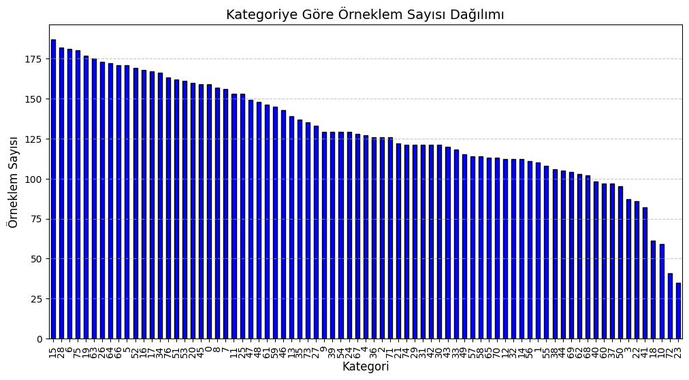
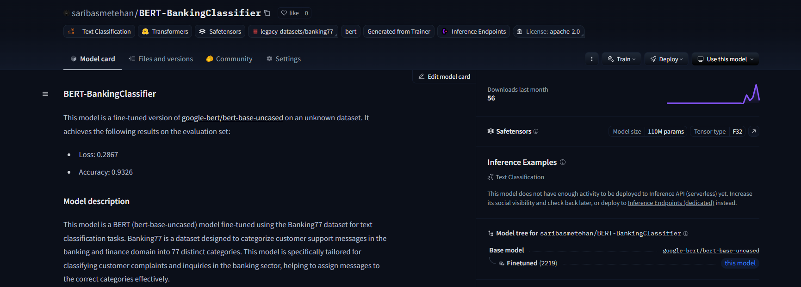
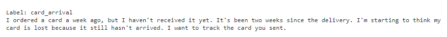
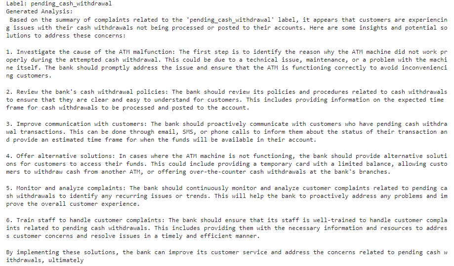
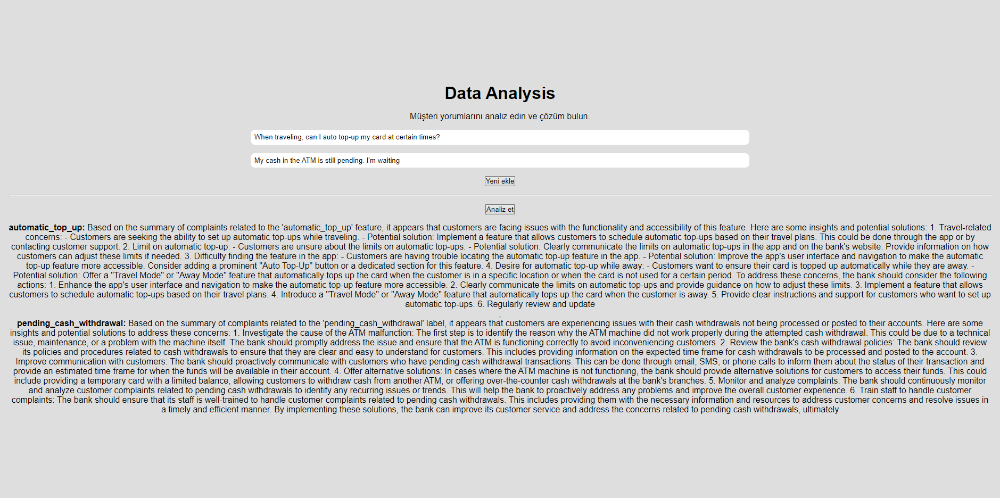

# Uçtan Uca Banka Yönetici Asistanı  

Bu depo, banka yöneticilerinin müşteri geri bildirimlerini analiz etmesine, önemli bilgileri özetlemesine ve uygulanabilir çözüm senaryoları üretmesine yardımcı olmak için geliştirilmiş bir uçtan uca projeyi içerir.

---

## Proje Özeti  

Proje şu odak noktalarına sahiptir:  
1. **Müşteri şikayetlerinin sınıflandırılması** için gelişmiş NLP modellerinin kullanımı.  
2. **Gruplanmış verilerin özetlenmesi** ile özlü bilgiler sunulması.
3. **Mini instruct llm ile Yöneticiler için çözüm senaryoları oluşturulması.**

---

## Veri Seti  

Bu proje için kullanılan veri seti, banka ile ilgili konularda etiketlenmiş müşteri şikayetlerini içeren banking77 veri setidir.

  

---

## İş Akışı ve Adımlar  

### 1. Sınıflandırma Modelleri  

#### a) SpaCy Modeli  
- **Transformer tabanlı bir NLP modeli**, müşteri şikayetlerini etkili bir şekilde "spacy en_core_web_trf" modeli sınıflandırmak için eğitildi.  

#### b) BERT Modeli  
- **Önceden eğitilmiş bir Transformer modeli**, daha güçlü sınıflandırma görevleri için "Fine Tuning" yapıldı ve bir pipeline'a entegre edildi.  

  

---

### 2. Veri Gruplama  

Müşteri şikayetleri, hedefe yönelik analiz için etiketlere göre gruplandırıldı.  

---

### 3. Özetleme  

Gruplanmış veriler, özlü bilgiler sunmak için bir ileri düzey özetleme modeli olan "philschmid/bart-large-cnn-samsum" kullanılarak özetlendi.  

  

---

### 4. Çözüm Senaryoları  

Yöneticilere özel çözüm senaryoları, bir mini instuct llm'e istek atılarak cevap alındı. İstek atılan llm ise "microsoft/Phi-3-mini-4k-instruct"

  

---
### 5. Local Yayın

Fast API kullanarak bir arayüz ile birleştirilerek local olarak proje yayına alındı.

  

### Adımlar ve Repository'de isimleri:
1. **Bert ile fine tuning** : `BERT_BankingClassifier.ipynb` 
2. **spaCy en_core_web_trf geliştirilmesi**: `Spacy_BankingClassifier.ipynb` 
3. **Modellerin performans testleri**: `Using_models.ipynb`  
4. **Labelların birleştirilip özgün dosyalarara kaydedilerek, özetlenmesi ve LLM'e yollanması**: `Summarization_Mini_instruct_LLM_with_Data_Analysis.ipynb`
5. **Tek bir yeni verinin ürün içerisinde gerçekleştiği tüm adımlar ve sonuçta LLM'in yöneticiye sunduğu tavsiye**: `Roadmap_for_just_a_example.ipynb`
6. **Birden fazla verinin ürün içerisinde gerçekleştiği tüm adımlar ve sonuçta LLM'in yöneticiye sunduğu tavsiye**: `Roadmap_for_examples.ipynb`
7. **Fast API yardımı ile local yayına alınması**: `Fast_API.ipynb`
8. **Görsellerin bulunduğu sunum dosyası**: 'Banka yönetici asistanı (1).pdf'

---

# End-to-End Bank Administrative Assistant  

This repository contains an end-to-end project developed to assist bank managers in analyzing customer feedback, summarizing key insights, and generating actionable solution scenarios.  

---

## Project Overview  

The project focuses on:  
1. **Classifying customer complaints** using advanced NLP models.  
2. **Summarizing grouped data** to provide concise insights.  
3. **Generating solution scenarios** tailored for managers.  

---

## Dataset  

The dataset used for this project is the banking77 dataset, which includes labeled customer complaints for banking-related issues.  

---

## Workflow and Steps  

### 1. Classification Models  

#### a) SpaCy Model  
- A **Transformer-based NLP model** was fine-tuned to classify customer complaints effectively using the "spacy en_core_web_trf" model.  

#### b) BERT Model  
- A **Pre-trained Transformer model** was fine-tuned for robust classification tasks and integrated into a pipeline.  

---

### 2. Data Grouping  

Customer complaints were grouped by labels for targeted analysis.  

---

### 3. Summarization  

Grouped data was summarized using an advanced summarization model, "philschmid/bart-large-cnn-samsum," to provide concise information.  

---

### 4. Solution Scenarios  

Custom solution scenarios were generated for managers by making requests to a mini instruct LLM, specifically "microsoft/Phi-3-mini-4k-instruct."  

---

### 5. Local Deployment  

The project was deployed locally using a FastAPI-based interface.  

---

### Steps and Corresponding Files in the Repository  

1. **Fine-tuning BERT**: `BERT_BankingClassifier.ipynb`  
2. **Developing SpaCy en_core_web_trf**: `Spacy_BankingClassifier.ipynb`  
3. **Performance Testing of Models**: `Using_models.ipynb`  
4. **Merging Labels, Summarizing Data, and Sending to LLM**: `Summarization_Mini_instruct_LLM_with_Data_Analysis.ipynb`  
5. **Example of a Single Input's Full Workflow**: `Roadmap_for_just_a_example.ipynb`  
6. **Example of Multiple Inputs' Full Workflow**: `Roadmap_for_examples.ipynb`  
7. **Local Deployment with FastAPI**: `Fast_API.ipynb`  

